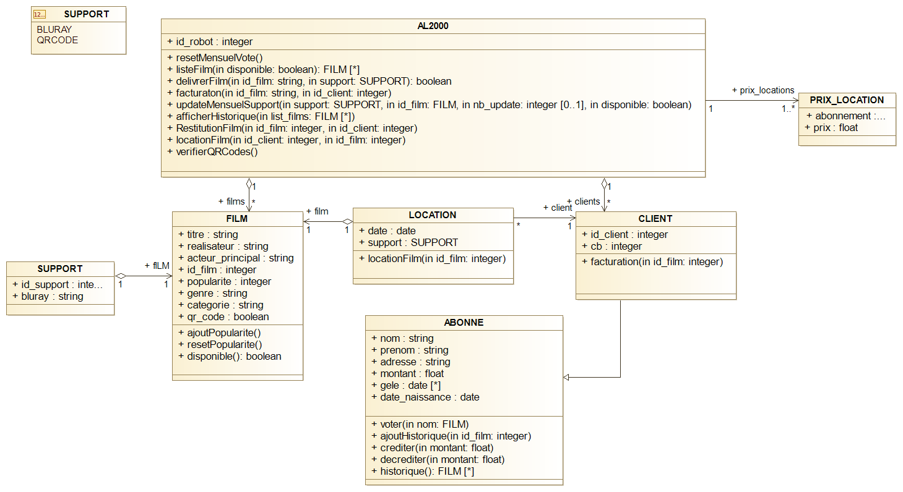

# projet-bd-m1-meef

### Contraintes:
- somme(Bluray a True)  + somme(bluray en location) <= 100
-->	au total dans la table support pas plus de 100 blueray 
- montant >= 15 à la création de carte ou lorsque on ajoute argent
- minimum crédité = 10 quand créditer()
- location total avec abonnement <= 3
- location total sans abonnement <= 1
-	si montant < 0 alors carte gelée
-	si montant > 15 alors carte dégelée

### Pour information :
-	Dans la table location : quand le film est rendu le support passa à NULL

### Schéma Relationnel :

FILM(id_film, titre, realisateur, acteur_principal, popularite, genre, age, qr_code) 

SUPPORT(id_support, bluray, #id_film)

PRIX_LOCATION(abonnement, prix)

CLIENT(id_client, cb)

ABONNE(#id_client, nom, prenom, date_naissance, adresse, montant, gele)

LOCATION(#id_client, #id_film, support, date)

### Schéma UML:

