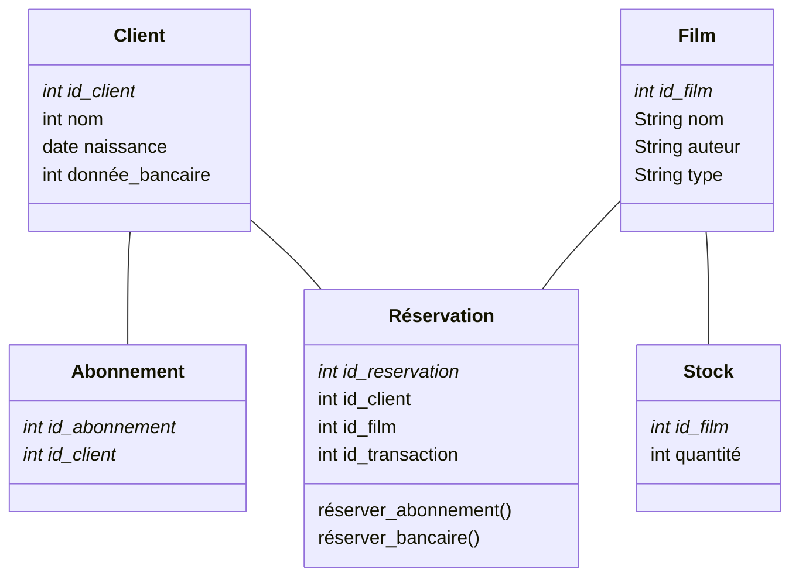

# projet-bd-m1-meef

¡Hola todos el mundo!

Schéma temporaire (si vous voulez modifier c'est du mermaid)

```mermaid
classDiagram
Client -- Abonnement
Client -- Réservation
Film -- Réservation
Film -- Stock

Client : int id_client*
Client : int nom
Client : date naissance
Client : int donnée_bancaire
Abonnement : int id_abonnement*
Abonnement : int id_client*
Film : int id_film*
Film : String nom
Film : String auteur
Film : String type
Réservation : int id_reservation*
Réservation : int id_client
Réservation : int id_film
Réservation : int id_transaction
Stock : int id_film*
Stock : int quantité

Réservation : réserver_abonnement()
Réservation : réserver_bancaire()
```
